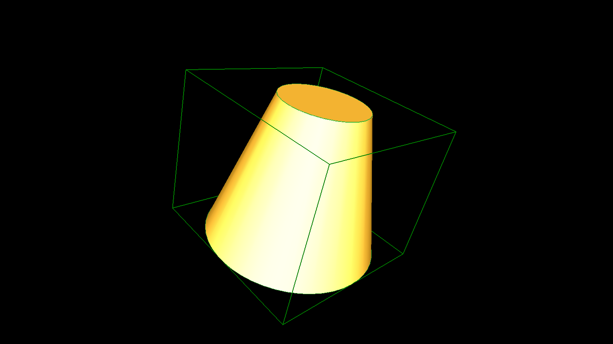

# occBasicTclSamples
Very basic OpenCASCADE examples that compile with g++


## Installation
Debian 11 (bullseye) was used as operating system.

```
  root> apt-get install g++ cmake cmake-curses-gui
  root> apt-get install tcllib tklib tcl-dev tk-dev libfreetype-dev libxt-dev libxmu-dev libxi-dev libgl1-mesa-dev libglu1-mesa-dev libfreeimage-dev libtbb-dev libgl2ps-dev 
  root> apt-get install doxygen graphviz
```
 
 
 	* Download OpenCascade from https://github.com/Open-Cascade-SAS/OCCT/releases.
 	  wget https://github.com/Open-Cascade-SAS/OCCT/archive/refs/tags/V7_8_1.zip

 	
 		user> mkdir opencascade
		user> cd opencascade/
		user> cp ~/Downloads/opencascade-7.1.0.tgz .
		user> tar -xvzf opencascade-7.1.0.tgz
		user> mkdir install
		user> mkdir build
		

		
# whether use optional 3rdparty or not
set (USE_TK        ON  CACHE BOOL "${USE_TK_DESCR}")
set (USE_FREETYPE  ON  CACHE BOOL "${USE_FREETYPE_DESCR}")
set (USE_FREEIMAGE ON CACHE BOOL "${USE_FREEIMAGE_DESCR}")
set (USE_FFMPEG    ON CACHE BOOL "${USE_FFMPEG_DESCR}")
set (USE_OPENVR    OFF CACHE BOOL "${USE_OPENVR_DESCR}")
set (USE_RAPIDJSON OFF CACHE BOOL "${USE_RAPIDJSON_DESCR}")
set (USE_DRACO     OFF CACHE BOOL "${USE_DRACO_DESCR}")
set (USE_TBB       OFF CACHE BOOL "${USE_TBB_DESCR}")
set (USE_EIGEN     OFF CACHE BOOL "${USE_EIGEN_DESCR}")


	* Compile:
		```
		user> make
		```
	* Install:
		```
		user> make install
		```
	* Add the OpenCascade libraries to your library path:
		```
		root> cd /etc/ld.so.conf.d/
		root> echo '/path_to/opencascade/install/lib' > opencascade.conf
		root> ldconfig
		```

		```
		export CASROOT=/usr/local/bin
		export LD_LIBRARY_PATH=/usr/local/lib/:$LD_LIBRARY_PATH
		```

		
* occBasicSamples

	```
	user> git clone https://github.com/quirxi/occBasicSamples.git
	user> cd occBasicSamples/src
	user> rm include lib path_to_OpenCascade_*
	user> ln -s ../../opencascade/install/lib/ lib
	user> ln -s ../../opencascade/install/include/ include
	user> cd Box
	user> make
			g++ -c -pipe -O3 -std=c++11 -Wall -W -g -D_REENTRANT -I../include/opencascade -o main.o main.cpp
			g++  -o aBox.exe main.o -L../lib   -lTKernel -lTKPrim -lTKTopAlgo -lTKSTL -lTKVRML -lTKBRep -lTKG3d -lTKMesh
	user> ./aBox.exe 
	```
		
		
## Available examples

## How to run

        Paste the TCL folder to the following location: 

	```
	/usr/local/share/opencascade/samples/tcl/


        cd /usr/local/share/opencascade/samples/tcl/
        DRAWEXE and press Enter
        source ANC101.tcl
	```


Up to now there are examples for following basic shapes and tcl_script available:

**`ANC101:`**


**`markers:`**


**`bottle:`**


**`materials:`**


**`dimensions:`**


**`cad:`**


**`snowflake:`**


**`MBBGehauseRohteil:`**


**`spheres:`**


**`cpu:`**


**`ModelingDemo:`**


**`cutter:`**


**`DataExchangeDemo:`**


**`vis_pbr_spheres:`**


**`drill:`**


**`VisualizationDemo:`**


**`Penrose:`**


**`pencil:`**


## References

* https://github.com/quirxi/occBasicSamples


## Fix library errors

	```
	git clone https://github.com/Tpj-root/occBasicTclSamples.git 
	cd occBasicTclSamples/src
	make
	```

**`Box:`**


**`Circle:`**


**`Cone:`**


**`Cylinder:`**


**`Sphere:`**


**`Torus:`**


		
